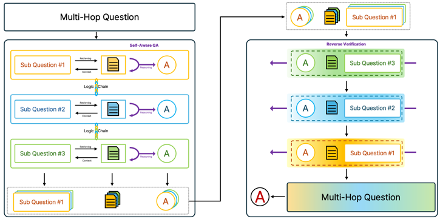
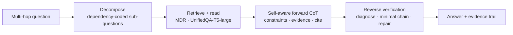
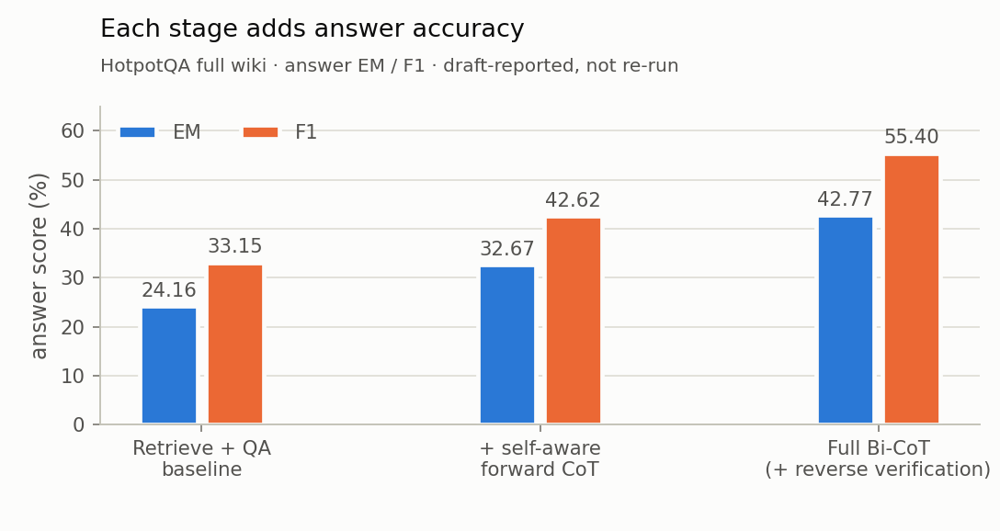

<sub>[🏠 Portfolio](https://github.com/heoneyzi) › [📄 Paper](../README.md) › **Bi-CoT**</sub>

<div align="center">

# 🔁 Bi-CoT — forward reasoning and reverse verification for multi-hop QA

**Can a multi-hop QA system show every intermediate step, and catch its own mistakes by checking the chain backwards, without training anything?**


*Plug-and-Play Bi-CoT: Self-Aware Forward Reasoning and Reverse Verification for Explainable Multi-Hop QA* — **Jiheon Kang**, Suhwan Jung

[📄 Paper (PDF)](Plug-and-Play%20Bi-CoT%20-%20Self-Aware%20Forward%20Reasoning%20and%20Reverse%20Verification%20for%20Explainable%20Multi-Hop%20QA.pdf) · [💻 Code (original repo)](https://github.com/heoneyzi/Bi-CoT) · [📦 Code in this portfolio](code/README.md) · [🗒️ Ideation notes](notes/README.md) · [🌐 Research site](https://heoneyzi.github.io)

</div>

> [!TIP]
> **TL;DR** — Multi-hop questions chain several facts, and forward-only pipelines let an early wrong answer propagate silently. Bi-CoT splits a question into dependency-coded sub-questions, answers each with a frozen retriever (MDR) and reader (UnifiedQA), checks every step against its evidence with self-aware forward reasoning (GPT-4.1 / GPT-4o prompts), then re-checks the chain in reverse before answering — no parameter updates. In the **draft-reported** HotpotQA full-wiki experiment, answer EM / F1 rise from **24.16 / 33.15** (retrieve + QA baseline) to **42.77 / 55.40** (+18.61 / +22.25 points).

| | |
|---|---|
| **Period** | 2025 (ideation notes from Jul 2025; accepted at the 6th Korea AI Conference, 2025) |
| **Team** | 2 authors — **Jiheon Kang** (first author, Yonsei University) and Suhwan Jung (Pukyong National University, per the manuscript) |
| **My role** | **First Author** (CV). The six released research notebooks come from his research archive, and the ideation notes in [`notes/`](notes/README.md) are his |
| **Stack** | Python · Hugging Face Transformers (UnifiedQA-T5-large) · MDR multi-hop dense retrieval · OpenAI API (GPT-4.1, GPT-4o) · HotpotQA |
| **Status** | ✅ Completed — accepted at the 6th Korea AI Conference (2025); archival code release (Sep 2026) |

<p align="center"></p>
<p align="center"><sub>Figure: method diagram from the Bi-CoT manuscript draft (also shown on the research site).</sub></p>

## 🧭 Why it matters

**Multi-hop question answering** needs facts from several documents: *“What government position was held by the woman who portrayed Corliss Archer in the film Kiss and Tell?”* first needs the actress, then her position (a HotpotQA example). Strong systems fine-tune the retriever and reader on the benchmark, and most return only a final answer plus a few passages, so when the answer is wrong it is hard to see which hop failed. Forward-only pipelines have a second weakness: a wrong early sub-answer is substituted into every later step with no chance of correction.

Bi-CoT keeps every model frozen and changes only the inference pipeline: it records the question, answer and evidence of every hop (explainability) and adds a backward pass that re-checks the chain against the original question (error correction). Because nothing is trained, the draft argues the pipeline can move to other domains without re-tuning; only HotpotQA was evaluated.

## 🛠️ Approach



- **Dependency-aware decomposition** — GPT-4.1 splits the question into at most three sub-questions, labels it *bridge* or *comparison*, and writes one paraphrase per sub-question to diversify retrieval. Later sub-questions point to earlier answers through placeholders (`[ANSWER_TO_SUBQUESTION_1]`) that are substituted once those answers exist; dependencies are coded compactly, e.g. `1-2` (Q2 ← Q1, Q3 ← Q2) or `0-12` (Q3 ← Q1 and Q2).
- **Retrieve and read** — every sub-question and paraphrase goes to MDR (multi-hop dense retrieval over Wikipedia), and UnifiedQA-T5-large gives a first answer. Sending the original question through the same path is the baseline.
- **Self-aware forward CoT** — a prompt makes the LLM extract the question's constraints, check each retrieved passage against them, confirm a candidate or derive a new answer from the context, and cite the single decisive passage as JSON (`exist`, `answer`, `evidence`).
- **Reverse verification** — starting from the original question, the LLM diagnoses the answer type and comparison type, builds a minimal chain back through the sub-questions (3 → 2 → 1), repairs or merges steps from the evidence, then answers and cites. The draft motivates it with comparison questions, where forward-only answers often broke the required form (yes/no, common attribute, A-or-B).
- **Where the idea came from** — Jiheon's ideation page (not published; it also holds the manuscript draft) starts from position bias in long contexts (“lost in the middle”), moves through decomposition (DecompRC, DecomP) and tree-of-thought search — see the [paper notes](notes/README.md) — and tabulates for 20 multi-hop question types whether a reverse question is well defined (bridge, conjunction, quantitative, location: yes; analogical, hypothetical, counterfactual: no).

## 🔬 Experiments & results

| # | Question | Setup | Key result | Folder |
|---|---|---|---|---|
| 1 | Does self-aware forward reasoning help? | HotpotQA full wiki · frozen MDR + UnifiedQA-T5-large · GPT-4.1 / GPT-4o prompts | EM 24.16 → **32.67**, F1 33.15 → **42.62** | [results](results/README.md) |
| 2 | Does reverse verification add on top? | same, plus the reverse pass | EM **42.77**, F1 **55.40** (+10.10 / +12.78 over forward only) | [results](results/README.md) |
| 3 | How often can the reverse pass run? | share of questions that reached reverse verification | **65.3%**; the other 34.7% lacked the evidence needed after retrieval and QA | [results](results/README.md) |
| 4 | Does the released evaluator work? | 2-question synthetic example, standard library only | 50.0 EM / 83.33 F1 (re-run Sep 2026) | [code](code/README.md) |

<p align="center">
<picture>
  <source media="(prefers-color-scheme: dark)" srcset="assets/ablation_dark.png">
  
</picture>
</p>
<p align="center"><sub>Figure: draft-reported ablation, drawn from <a href="results/reported_results.csv"><code>results/reported_results.csv</code></a> by <code>results/plot_results.py</code>.</sub></p>

The coverage number is the useful diagnostic: reverse verification could only run where retrieval had surfaced the needed evidence, and the draft reads this as headroom — a stronger retriever should raise both coverage and the final score.

## 🙋 My contribution

- **First author** of the paper (CV).
- The six released research notebooks — dependency-aware decomposition, MDR + UnifiedQA orchestration with GPU-memory handling, forward-CoT evidence checks, final answer/evidence aggregation and EM/F1 evaluation — come from his `AI_Study` research archive ([provenance](code/docs/PROVENANCE.md)); Git history does not establish per-notebook authorship.
- His ideation database (“지헌 Ideation”) records the path from the lost-in-the-middle problem to decomposition-based multi-hop QA ([notes](notes/README.md)).
- Prepared the public archival release (author of its Sep 2026 commit): outputs, API-key literals and machine paths removed; the notebook's EM/F1 functions extracted unchanged into an offline evaluator.
- Suhwan Jung is the co-author; the sources do not document how the work was divided, so no finer attribution is claimed.

## 🗂️ Repository map

```text
Bi-CoT/
├── Plug-and-Play Bi-CoT - Self-Aware Forward Reasoning and Reverse Verification for Explainable Multi-Hop QA.pdf  ← paper PDF
├── README.md            ← you are here
├── assets/              ← method diagram (manuscript) + ablation chart (light/dark)
├── results/             ← draft-reported numbers (CSV), chart script, README
├── notes/               ← 4 ideation paper notes (Korean) + index
└── code/                ← archival release, mirrored from the public repo (+ README)
    ├── notebooks/       ← 6 recovered research notebooks (outputs stripped)
    ├── tools/           ← offline EM/F1 evaluator (notebook metric, unchanged)
    ├── examples/        ← synthetic gold/prediction files
    └── docs/            ← research notes, workflow & external requirements, provenance
```

## ♻️ Reproduce

```bash
cd 02_Paper/Bi-CoT/code
python tools/evaluate_predictions.py --gold examples/gold.json --predictions examples/predictions.json
#   -> 50.0 EM / 83.33 F1 on the synthetic 2-question example (Python standard library only)
python -m pip install -r requirements.txt && jupyter lab notebooks   # read / adapt the research notebooks
```

Not included: HotpotQA, the MDR retriever weights and Wikipedia index, UnifiedQA weights, API access and any prediction dumps. [`code/docs/WORKFLOW.md`](code/docs/WORKFLOW.md) lists what to obtain and which notebook functions implement each stage.

> [!IMPORTANT]
> **Scope notes**
> - The EM/F1 rows are **draft-reported** (the manuscript's first results table) and were not re-run; the archive lacks the exact question IDs, final prompt variants and a locked environment.
> - An earlier draft note says the experiment used **505 randomly sampled** HotpotQA full-wiki questions, not the full dev set; the IDs are not archived.
> - Scores are answer-only EM/F1 with SQuAD-style normalisation — not HotpotQA supporting-fact or joint metrics.
> - The notebooks contain the decomposition, retrieval/QA, forward-CoT and final aggregation code; a standalone, verified implementation of every reverse-verification step was not recovered.
> - A second table in the draft compares against fine-tuned systems on a conditional subset (questions where the QA answer was usable); it is not used as a headline.
> - LLM stages call hosted models (GPT-4.1, GPT-4o) whose snapshots change, so a re-run is a new experiment.
> - The uploaded PDF uses the title shown above and spells the co-author “Jeong Su Hwan”; author romanization on this page follows the CV.

## 🔗 Links

- 💻 Original repository: [heoneyzi/Bi-CoT](https://github.com/heoneyzi/Bi-CoT) · 🌐 [Research site](https://heoneyzi.github.io)
- 🗒️ [Ideation notes](notes/README.md) · 📄 other 2025 paper: [FTF-VTG](../FTFVTG/README.md)
- 🧰 Upstream components: [MDR](https://github.com/facebookresearch/multihop_dense_retrieval) · [HotpotQA](https://hotpotqa.github.io/) · [UnifiedQA-T5-large](https://huggingface.co/allenai/unifiedqa-t5-large)

<details>
<summary><b>📑 BibTeX</b></summary>

```bibtex
@inproceedings{kang2025bicot,
  title     = {Plug-and-Play Bi-CoT: Self-Aware Forward Reasoning and Reverse Verification for Explainable Multi-Hop QA},
  author    = {Kang, Jiheon and Jung, Suhwan},
  booktitle = {The 6th Korea Artificial Intelligence Conference},
  year      = {2025}
}
```

The title follows the uploaded PDF; author romanization follows the CV.

</details>

---
<sub>[← Prev: FTF-VTG](../FTFVTG/README.md) · [🏠 Portfolio](https://github.com/heoneyzi) · [Next: GeoFlowAgent →](https://github.com/heoneyzi/Medical/blob/main/GeoFlowAgent/README.md)</sub>
