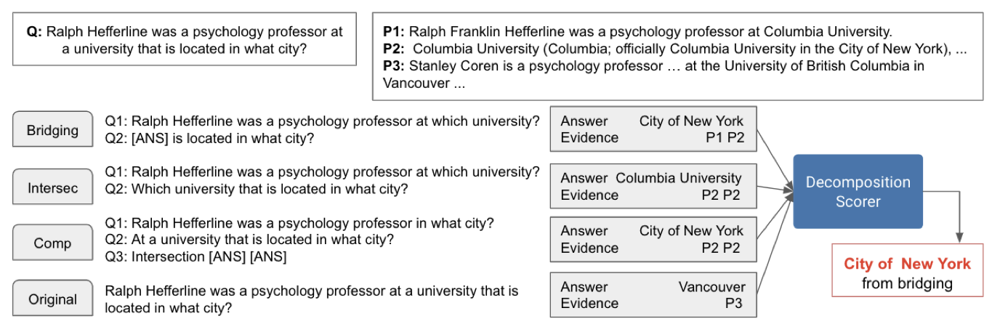

# Multi-hop Reading Comprehension through Question Decomposition and Rescoring (DecompRC)

[🏠 Portfolio](https://github.com/heoneyzi) › [📄 Paper](../../README.md) › [Bi-CoT](../README.md) › [Notes](README.md) › **DecompRC**

> [!NOTE]
> **Ideation note (2025, in Korean)** — Question decomposition into single-hop sub-questions per reasoning type, then rescoring. Note records the design choice to decompose with an LLM instead of span extraction. From Jiheon Kang's ideation database (지헌 Ideation) for the work that became Bi-CoT; converted from Notion.

[https://aclanthology.org/P19-1613.pdf](https://aclanthology.org/P19-1613.pdf)

Multi-hop QA를 목적으로 함

방법

1. Single-hop으로 기존 질문을 쪼갠다.
    > 💡 쪼개는 방법을 SPAN을 이요해 특정 단어를 뽑아와서 쪼개는 것으로 봤지만, 굳이? 우리는 LLM을 사용하자.
2. 총 4가지 (Bridging, Intersection, Composition, Original)의 reasoning type에 맞게 답을 구성한다.

    | **Reasoning Type** | **의미** | 그림 예시 |
    |---|---|---|
    | Bridging | 중간 매개 항목을 찾아서 최종 목표에 도달 | Q1: Hefferline은 어느 대학? → Q2: 그 대학은 어느 도시에 있나? |
    | Intersection | 여러 조건을 만족하는 답을 찾음 | Q1: 어느 대학? → Q2: 어떤 대학이 어떤 도시에 있는가? |
    | Composition | 두 개의 sub-answer를 조합하여 교집합 | Q1: 어느 도시에 있는가?  Q2: 그 도시는 어떤 대학과 연결? |
    | Original | 원 질문 그대로 사용 | Q: Hefferline은 어느 도시에 있는 대학에서 교수인가? |
3. Decomposition Scoring & Rescoring을 사용해 각 4가지 답안에 대한 가중치를 매겨 최종 답안을 선정한다.
    > 💡 x = \[질문\] + \[reasoning type\] + \[answer\] + \[evidence\]을 그대로 LLM에 넣어서 나온 결과가 답.

 

---
[🗒️ Notes index](README.md) · [Bi-CoT](../README.md) · [Tree of Thoughts →](02_tree_of_thoughts.md)
