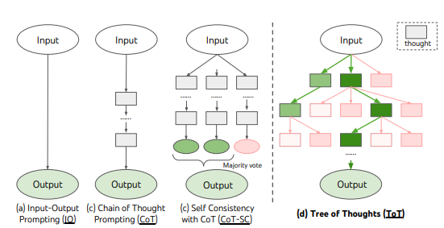

# Tree of Thoughts: Deliberate Problem Solving with Large Language Models (ToT)

[🏠 Portfolio](https://github.com/heoneyzi) › [📄 Paper](../../README.md) › [Bi-CoT](../README.md) › [Notes](README.md) › **Tree of Thoughts**

> [!NOTE]
> **Ideation note (2025, in Korean)** — Tree-structured reasoning with self-evaluation and backtracking; considered as the fallback when a reasoning loop fails. From Jiheon Kang's ideation database (지헌 Ideation) for the work that became Bi-CoT; converted from Notion.

#### 🧩 핵심 아이디어

- CoT는 직선적이며 단일 추론 경로에 한정됨. **ToT는 사고 과정을 “트리로 확장”하여** 다양한 reasoning path를 탐색하고, 불일치하거나 막히면 **backtracking**.
- 전략적 선택과 self-evaluation을 통해 최종 합리적 경로를 선택함.
- 복잡한 퍼즐(예: Game of 24)에서 <b>GPT-4 기준 성능이 4% → 74%</b>로 비약적 향상.

다시 루프로 돌아갈 때, 그 땐 ToT를 적용하는? 

---
[← DecompRC](01_decomprc.md) · [🗒️ Notes index](README.md) · [Bi-CoT](../README.md) · [Auto-CoT →](03_auto_cot.md)
