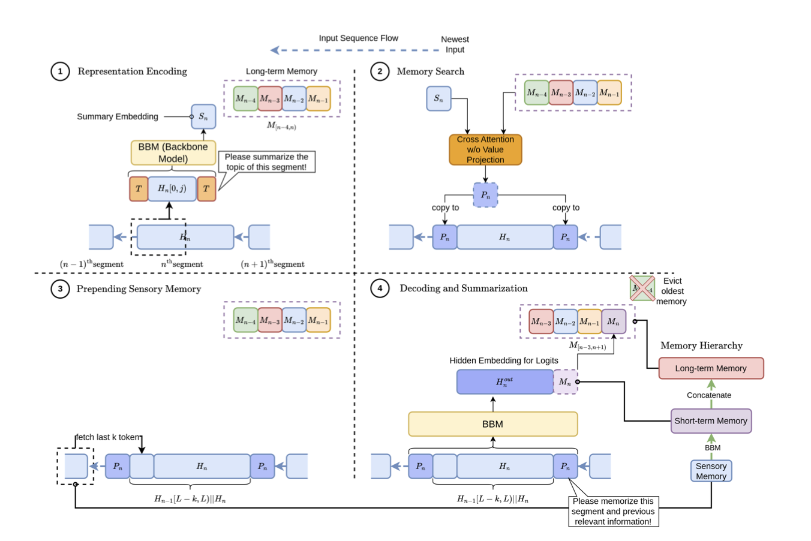

# HMT: Hierarchical Memory Transformer for Efficient Long Context Language Processing

[🏠 Portfolio](https://github.com/heoneyzi) › [📄 Paper](../../README.md) › [Bi-CoT](../README.md) › [Notes](README.md) › **HMT**

> [!NOTE]
> **Ideation note (2025, in Korean)** — Segment-level memory for long contexts; read while exploring the "lost in the middle" position-bias problem that preceded Bi-CoT. From Jiheon Kang's ideation database (지헌 Ideation) for the work that became Bi-CoT; converted from Notion.

**①**

- T: 학습 가능한 prompt (segment summarization prompt)
- Hₙ\[0, j\]: segment의 앞쪽 일부 토큰 (처음 j개)
- 이 입력을 BBM (e.g. BERT, RoBERTa)에 통과시켜 **hidden state** 추출
- 가장 마지막 hidden vector 또는 pooling vector를 사용해 → **요약 embedding** S_n 생성

**②**

- 과거 요약 memory 중 현재 segment와 관련 있는 정보만 선택
- 연산 효율성을 위해 Value projection 생략

**③**

- H_\{n-1\}\[L-k:L\]: 이전 segment의 마지막 k개 토큰 (tail)
- P_n: memory search 결과로 얻은 관련 context

**④**

- H_n\^\{out\}: 문서 분류, 요약, QA 등 downstream task에 사용
- M_n: 다음 segment에서 memory 검색에 사용됨

H₀ → M₀ H₁ (+ M₀, tail₀) → M₁ H₂ (+ M₀, M₁, tail₁) → M₂ ...

---
[← Auto-CoT](03_auto_cot.md) · [🗒️ Notes index](README.md) · [Bi-CoT](../README.md)
