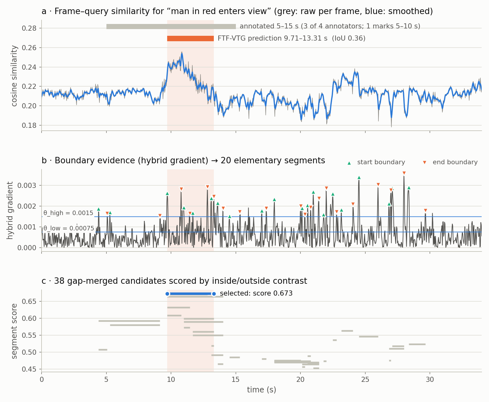
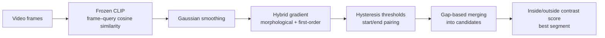
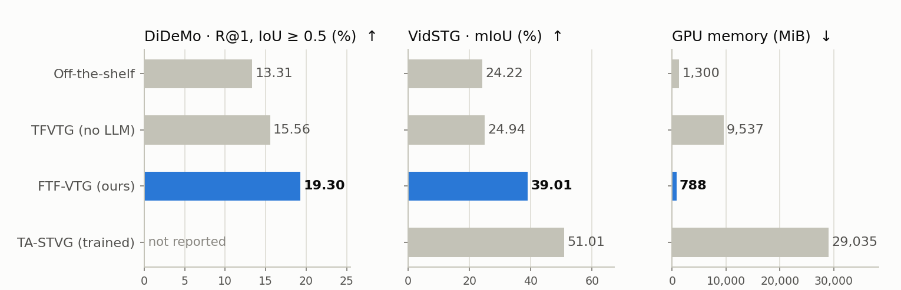
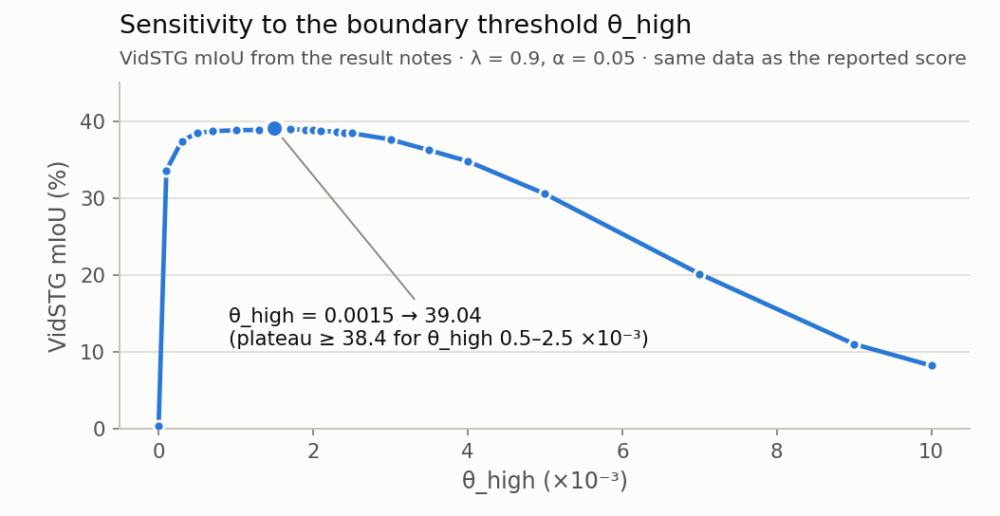

<sub>[🏠 Portfolio](https://github.com/heoneyzi) › [📄 Paper](../README.md) › **FTF-VTG**</sub>

<div align="center">

# 🎬 FTF-VTG — frame-level, training-free video temporal grounding

**Can one frozen image–text model find *when* a sentence happens in a video, with no training, no LLM and under 1 GB of GPU memory?**


*Frame-Level Understanding for Lightweight and Explainable Video Temporal Grounding* — **Jiheon Kang**, Suyong Kim, Harim Noh, Heejae Yang

[📄 Paper (PDF)](Frame-Level%20Understanding%20for%20Lightweight%20and%20Explainable%20Video%20Temporal%20Grounding.pdf) · [💻 Code (original repo)](https://github.com/heoneyzi/Frame_based_Training_Free-Video_Temporal_Grounding) · [📦 Code in this portfolio](code/README.md) · [🎥 How the project started](https://github.com/heoneyzi/Deep_Daiv/blob/main/Project/Multimodal/README.md) · [📰 Newsletter #109](https://stib.ee/PbLJ)

</div>

> [!TIP]
> **TL;DR** — Video temporal grounding (VTG) returns the start and end of the moment a sentence describes. FTF-VTG treats a video as a sequence of still frames: one frozen CLIP model scores every frame against the query, and a short signal-processing pipeline turns that similarity curve into a segment — no training, no proposal network, no LLM. In the paper's result notes it reaches **19.30 R@1 (IoU ≥ 0.5) on DiDeMo** and **39.01 mIoU on VidSTG** using **788 MiB** of GPU memory, versus 15.56 / 24.94 at 9,537 MiB for a TFVTG baseline run without its LLM stage.

| | |
|---|---|
| **Period** | Nov 2024 – Summer 2025 (deep daiv. multimodal track → IEIE Summer Annual Conference 2025) |
| **Team** | 4 authors — **Jiheon Kang** (first author, team lead), Suyong Kim, Harim Noh, Heejae Yang |
| **My role** | **First Author · Team Lead** of the deep daiv. Video Temporal Grounding research (CV). Led the research team, and maintains the public implementation (packaging, CLI, validation, tests; Sep 2026) |
| **Stack** | Python · PyTorch · OpenCV · NumPy · CLIP (`openai/clip-vit-base-patch32`) |
| **Status** | ✅ Completed — accepted at the 2025 IEIE Summer Annual Conference; code maintained |

<p align="center">
<picture>
  <source media="(prefers-color-scheme: dark)" srcset="assets/hero_dark.png">
  
</picture>
</p>
<p align="center"><sub>Figure: every FTF-VTG stage on the one DiDeMo example bundled with the code — drawn by <code>code/scripts/plot_pipeline_example.py</code> from the package's own functions (historical defaults, θ_high = 0.0015). An illustration, not a benchmark result.</sub></p>

## 🧭 Why it matters

**Video temporal grounding** takes an untrimmed video and a sentence and returns the time span the sentence describes — the building block of video search, highlight detection and event summaries. Most VTG models are trained on segment-level labels, which are expensive to collect and transfer poorly to new domains. Training-free methods drop the labels but usually add large models: TFVTG (Zheng et al., ECCV 2024) decomposes the query with an LLM, matches sub-events with BLIP-2, and searches sliding-window proposals.

FTF-VTG starts from a simpler observation, visible in panel **a** above: when a strong image–text model scores each frame against the query, the similarity rises when the described event starts and falls when it ends. If the boundaries are visible in that 1-D curve, grounding becomes a signal-processing problem, and every decision can be traced back to the curve. *Metrics used below:* **IoU** = overlap ÷ union of the predicted and true spans; **R@1 (IoU ≥ 0.5)** = share of queries whose prediction reaches IoU 0.5; **mIoU** = mean IoU.

## 🛠️ Approach



- **Similarity curve** — sampled frames and the query are embedded by a pre-trained image–text model (CLIP ViT-B/32 in the result notes); their cosine similarities form a curve $x_1,\dots,x_T$. The released package starts from this precomputed curve.
- **Boundary evidence** — after Gaussian smoothing, $g_t=\alpha\,[\mathrm{dilate}(x)-\mathrm{erode}(x)]_t+(1-\alpha)\,\lvert\nabla x_t\rvert$ highlights sharp rises and falls. Hysteresis keeps strong edges ($g_t>\theta_{high}$) and weak edges next to them; consecutive edge groups alternate as start/end boundaries of elementary segments.
- **Candidates** — elementary segments closer than `gap_threshold` samples are chained into longer candidates, so an event interrupted by a brief dip can still be recovered.
- **Scoring** — each candidate $[s,e]$ gets a static contrast term and a support term, and the maximum wins:

$$S(s,e)=\lambda\,\frac{\bar{x}_{[s,e]}}{\bar{x}_{\notin[s,e]}}+(1-\lambda)\,\frac{\lvert\lbrace t\in[s,e]:x_t\ge\bar{x}\rbrace\rvert}{\lvert\lbrace t\notin[s,e]:x_t\ge\bar{x}\rbrace\rvert}$$

The team also explored an 8-hyper-parameter variant (derivative statistics with adaptive thresholds, a decayed dynamic score, TFVTG-style static + dynamic terms), documented in the [design notes](https://github.com/heoneyzi/Deep_Daiv/blob/main/Project/Multimodal/notes/06_ftfvtg_score_design/README.md). The released code — and the parameter sweeps in the result notes (θ_high, λ, α) — use the hybrid-gradient version above.

## 🔬 Experiments & results

| # | Question | Setup | Key result | Folder |
|---|---|---|---|---|
| 1 | Is a frame-level curve enough to ground events? | DiDeMo (R@1, IoU ≥ 0.5) and VidSTG (mIoU), training-free rows | **19.30** vs 15.56 (TFVTG, no LLM) and 13.31 (off-the-shelf); **39.01** vs 24.94 and 24.22 | [results](results/README.md) |
| 2 | What does it cost? | GPU memory recorded with nvidia-smi | **788 MiB** vs 9,537 (TFVTG) and 1,300 (off-the-shelf) | [results](results/README.md) |
| 3 | How sensitive is the boundary threshold? | VidSTG, θ_high sweep (λ = 0.9, α = 0.05) | mIoU ≥ 38.41 for θ_high 0.0005–0.0025; 0.36 at θ = 0 and 8.16 at θ = 0.01 | [results](results/README.md#hyper-parameter-sweeps) |
| 4 | Does it extend to moment retrieval? | DiDeMo VMR: rank DiDeMo's 21 candidate moments by IoU with the prediction | R@1 36.90 (notes list an upper bound of 74.75) | [results](results/README.md) |
| 5 | Does the released code run end-to-end? | synthetic demo + 12 edge-case tests, CPU | 12 passed (re-run for this portfolio, Sep 2026) | [code](code/README.md) |

| Method | Training | Backbone | Proposal strategy | DiDeMo R@1 (IoU ≥ 0.5) | VidSTG mIoU | GPU memory (MiB) |
|---|---|---|---|---:|---:|---:|
| Off-the-shelf (Diwan et al., 2022) | training-free | CLIP + PySceneDetect + watershed | shot detection + watershed | 13.31 | 24.22 | 1,300 |
| TFVTG without LLM stage (Zheng et al., 2024) | training-free | BLIP-2 | sliding window | 15.56 | 24.94 | 9,537 |
| **FTF-VTG (ours)** | **training-free** | **CLIP** | **similarity-curve post-processing** | **19.30** | **39.01** | **788** |
| TA-STVG — trained reference | trained | — | — | — | 51.01 | 29,035 |

<sub>Source: result table in the team's paper notes (2025), transcribed to <a href="results/reported_results.csv"><code>results/reported_results.csv</code></a>. Not re-run for this portfolio.</sub>

<p align="center">
<picture>
  <source media="(prefers-color-scheme: dark)" srcset="assets/results_comparison_dark.png">
  
</picture>
</p>
<p align="center">
<picture>
  <source media="(prefers-color-scheme: dark)" srcset="assets/theta_sensitivity_dark.png">
  
</picture>
</p>
<p align="center"><sub>Figures: reported comparison (top) and VidSTG θ_high sweep (bottom), drawn from the CSVs by <code>code/scripts/plot_reported_results.py</code>.</sub></p>

## 🙋 My contribution

- **Team Lead** of the deep daiv. Video Temporal Grounding research team and **first author** of the IEIE paper (CV).
- Studied the training-free VTG literature the method builds on — his track notes include a [TFVTG review](https://github.com/heoneyzi/Deep_Daiv/blob/main/Project/Multimodal/notes/03_tfvtg_review/README.md), and the team's post-processing / scoring [design notes](https://github.com/heoneyzi/Deep_Daiv/blob/main/Project/Multimodal/notes/06_ftfvtg_score_design/README.md) were kept in the same notebook.
- Maintains the public implementation (author of the Sep 2026 maintenance commit): checked the recovered backup against the original public code, packaged it as `ftf_vtg` with a portable CLI, explicit dataset adapters, input validation and tests.
- Suyong Kim, Harim Noh and Heejae Yang are co-authors; the sources do not document how experiments were split within the team, so no finer attribution is claimed.

## 🗂️ Repository map

```text
FTFVTG/
├── Frame-Level Understanding for Lightweight and Explainable Video Temporal Grounding.pdf  ← paper PDF
├── README.md              ← you are here
├── assets/                ← figures (light + dark), generated by code/scripts/
├── results/               ← reported numbers transcribed from the paper notes (+ README)
└── code/                  ← the ftf_vtg package, mirrored from the public repo (+ README)
    ├── ftf_vtg/           ← algorithm, CLI, dataset adapters, historical monolithic variant
    ├── tests/             ← 12 synthetic and edge-case tests
    ├── examples/          ← two real precomputed similarity curves (DiDeMo, VidSTG), one video each
    └── scripts/           ← figure scripts for this page (portfolio addition)
```

## ♻️ Reproduce

```bash
cd 02_Paper/FTFVTG/code
python -m pip install -r requirements.txt   # numpy, torch, opencv-python-headless; add matplotlib for figures
python -m ftf_vtg --demo                    # synthetic low-high-low curve, CPU only
python -m pytest -q tests                   # 12 tests
python scripts/plot_pipeline_example.py     # hero + observation figures from examples/
python scripts/plot_reported_results.py     # charts from ../results/*.csv
```

Not included: DiDeMo and VidSTG videos, the full processed similarity files (the original repository lists Google Drive pointers that were not revalidated), and the CLIP feature-extraction step. `examples/` holds two single-video curves for smoke tests only.

> [!IMPORTANT]
> **Scope notes**
> - Headline numbers are transcribed from the team's result notes for the IEIE paper (2025). They were **not re-run** for this portfolio or in the Sep 2026 maintenance release; processed features, final hyper-parameters and evaluation IDs would be needed to reproduce them.
> - The θ_high / λ / α sweeps were run on the **same VidSTG data** as the reported score; no separate validation split is documented. The maintained code expects hyper-parameters fixed on a validation split.
> - The TFVTG row is TFVTG **without its LLM stage** (BLIP-2 + sliding window), as recorded in the notes; TA-STVG is a trained spatio-temporal model listed only as a reference point.
> - GPU memory is the nvidia-smi reading recorded in the notes; batch settings differ between rows (FTF-VTG: 788 MiB unbatched, 1,027 MiB at batch 64).
> - The notes list the VMR score next to fine-tuned video-retrieval models evaluated under a different protocol, so no ranking claim is made for row 4.
> - The bundled evaluation adapters keep the historical endpoint conventions and are not official benchmark evaluators.

## 🔗 Links

- 💻 Original repository: [heoneyzi/Frame_based_Training_Free-Video_Temporal_Grounding](https://github.com/heoneyzi/Frame_based_Training_Free-Video_Temporal_Grounding) · 🌐 [Research portfolio — publications](https://heoneyzi.github.io/#papers)
- 🎥 Where the project came from: [deep daiv. multimodal track](https://github.com/heoneyzi/Deep_Daiv/blob/main/Project/Multimodal/README.md) · 🗒️ [TFVTG review](https://github.com/heoneyzi/Deep_Daiv/blob/main/Project/Multimodal/notes/03_tfvtg_review/README.md) · [design notes](https://github.com/heoneyzi/Deep_Daiv/blob/main/Project/Multimodal/notes/06_ftfvtg_score_design/README.md)
- 📰 Newsletter #109 “AI는 어떻게 동영상 하이라이트를 만들까?” (2025-09-17): [stib.ee/PbLJ](https://stib.ee/PbLJ) · [newsletter archive](https://github.com/heoneyzi/Deep_Daiv/blob/main/Contents/NewsLetter/README.md)
- 📚 Related work: TFVTG — Zheng et al., ECCV 2024 ([arXiv:2408.16219](https://arxiv.org/abs/2408.16219)) · zero-shot moment retrieval with off-the-shelf models — Diwan et al., 2022 ([arXiv:2211.02178](https://arxiv.org/abs/2211.02178))

<details>
<summary><b>📑 BibTeX</b></summary>

```bibtex
@inproceedings{kang2025ftfvtg,
  title     = {Frame-Level Understanding for Lightweight and Explainable Video Temporal Grounding},
  author    = {Kang, Jiheon and Kim, Suyong and Noh, Harim and Yang, Heejae},
  booktitle = {2025 IEIE Summer Annual Conference},
  year      = {2025}
}
```

The title follows the uploaded PDF; full author names follow the CV.

</details>

---
<sub>[← Prev: GDTR (paper)](../GDTR/README.md) · [🏠 Portfolio](https://github.com/heoneyzi) · [Next: Bi-CoT →](../Bi-CoT/README.md)</sub>
