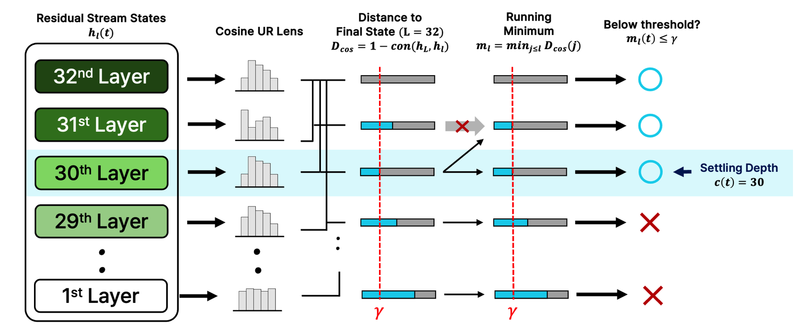
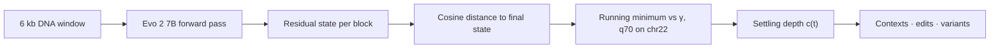
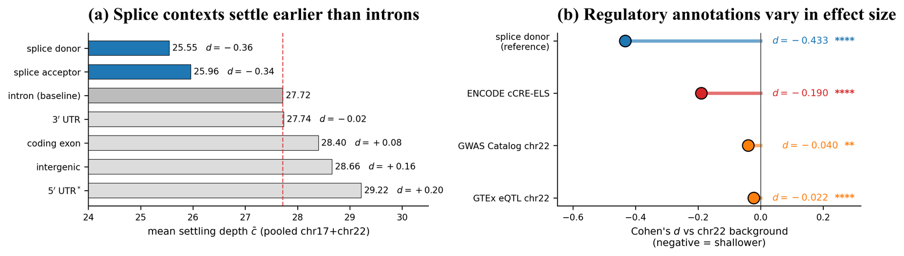
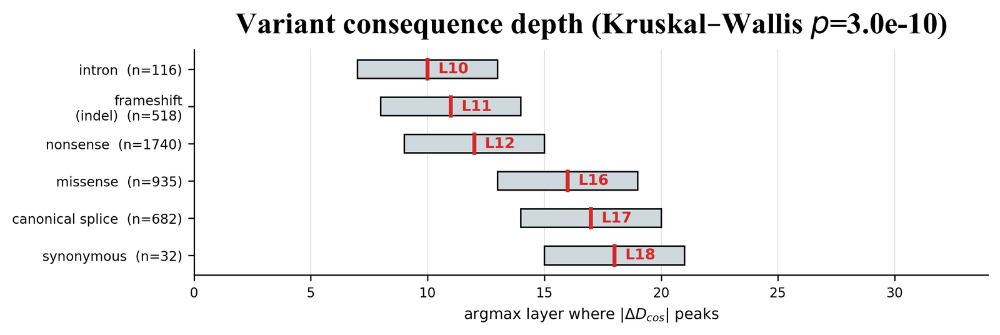
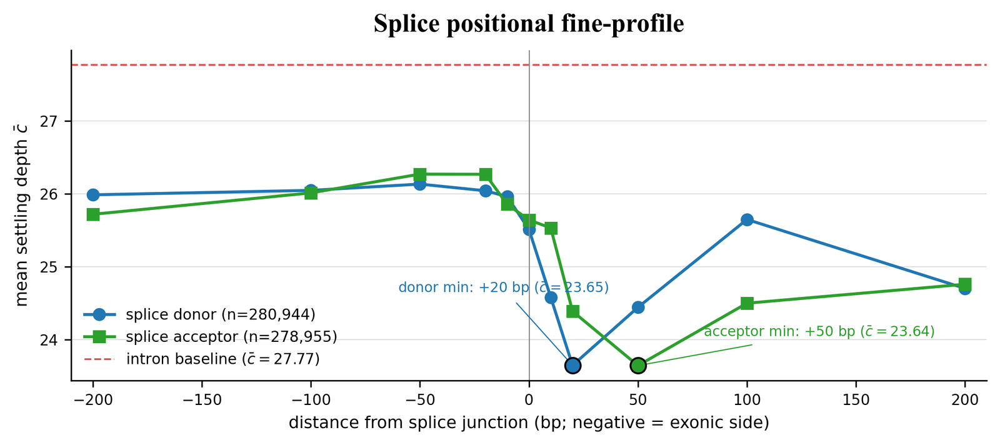

<sub>[🏠 Portfolio](https://github.com/heoneyzi) › [📄 Paper](../README.md) › **GDTR**</sub>

<div align="center">

# 🧬 GDTR — Layer-wise Settling Depth Reveals Biological Grammar in Genomic Foundation Models

**At which layer does a DNA language model "make up its mind" about a nucleotide — and does that depth tell us anything about biology?**

[](https://openreview.net/forum?id=Z9h1jiPbus)     

[📄 OpenReview](https://openreview.net/forum?id=Z9h1jiPbus) · [📑 bioRxiv](https://www.biorxiv.org/content/10.64898/2026.07.14.738370v1) · [💻 Team code (TDiG)](https://github.com/YAICON-8th-Think-Deep-in-Genome/TDiG) · [🔬 Full research program](https://github.com/heoneyzi/Medical/blob/main/GDTR/README.md)

</div>

> [!TIP]
> **TL;DR** — GDTR is a training-free lens that gives every nucleotide a *settling depth*: the first layer at which its residual-stream state lines up with the model's final state. On Evo 2 7B, splice donor/acceptor sites settle ~2 layers earlier than intronic and coding sequence (donor Cohen's *d* = −0.43 against a chr22 per-position background), and a threshold calibrated on chr22 transfers to held-out chr17 with **94.6 % of the effect magnitude retained**. Motif edits and flank shuffles push the depth in opposite directions, and ClinVar consequence classes peak at different layers (Kruskal–Wallis *p* = 3.0 × 10⁻¹⁰).

<details>
<summary><b>🇰🇷 한국어 요약</b></summary>

GDTR은 DNA 언어모델(Evo 2 7B)이 염기 하나하나에 대해 **몇 번째 층에서 판단을 마치는지**를 재는, 추가 학습이 필요 없는 해석 도구입니다.
각 층의 내부 표현(residual stream)이 마지막 층의 표현과 얼마나 같은 방향을 가리키는지(코사인 거리)를 층마다 보고, 처음으로 충분히 가까워지는 층을 그 염기의 **정착 깊이(settling depth)** 로 정합니다.
비유하자면 여러 편집자가 차례로 원고를 고칠 때 "몇 번째 편집자부터 이 문장이 더 이상 바뀌지 않는가"를 기록하는 것과 같습니다.
그 결과 유전자의 이어붙이기 경계인 스플라이스 부위는 인트론보다 약 2층 먼저 정착했고, 22번 염색체에서 정한 기준을 17번 염색체에 그대로 적용해도 효과 크기의 94.6%가 유지되었습니다.
핵심 모티프(GT)를 바꾸면 정착이 늦어지고 주변 서열을 섞으면 오히려 빨라져, 이 지표가 "모티프 인식"과 "주변 문맥 통합"을 구분해 보여 줍니다.
ClinVar 변이도 종류(넌센스·미스센스·동의 변이 등)에 따라 표현을 가장 크게 흔드는 층이 달랐습니다.
저는 저자로서 Evo 2의 층별 정착 분석에 참여했습니다.

</details>

| | |
|---|---|
| **Venue** | ICML 2026 GenBio **Workshop** — accepted for oral presentation (a workshop paper, not the main conference) |
| **Authors** | Yoonjin Cho, **Jiheon Kang**, Subin Park, Prof. Sangwoo Kim (corresponding) — Yonsei University |
| **My role** | Author — layer-wise settling analysis on Evo 2 7B ([details](#-my-contribution)) |
| **Model / data** | Evo 2 7B · GRCh38 chr22 (calibration) + chr17 (held-out) · GENCODE v44 · ClinVar (2026-04-18) · ENCODE cCRE, GTEx eQTL, GWAS Catalog |
| **Stack** | PyTorch · Evo 2 / Vortex · NumPy · SciPy · scikit-learn · one NVIDIA H200 (~20 GPU-hours end-to-end) |
| **Status** | ✅ Accepted (Oral) · preprint on bioRxiv · 🔄 follow-up research ongoing — see [01_Medical/GDTR](https://github.com/heoneyzi/Medical/blob/main/GDTR/README.md) |

<p align="center"></p>
<p align="center"><sub>Figure 1 of the paper. Each layer's residual state is compared with the final state (cosine lens); the running minimum first drops below γ at the settling depth — here c(t) = 30.</sub></p>

## 🧾 Abstract (paraphrased)

Genomic foundation models learn detailed sequence rules, but existing tools rarely say *at which depth* a given piece of biological grammar becomes stable inside them. GDTR — the **G**enomic **D**eep-**T**hinking **R**atio, adapted from an NLP reasoning-effort measure — needs no training: for every nucleotide it records the first layer whose residual-stream state is close enough, in cosine distance, to the model's post-final-norm state. On Evo 2 7B this places splice donors and acceptors about two layers earlier than intronic and coding sequence, gives enhancer-like ENCODE cCREs a smaller but measurable shift, and a threshold fixed once on chromosome 22 carries over to held-out chromosome 17. The readout moves in *both* directions under targeted edits — breaking the donor's central GT delays settling, while scrambling its flanks lets the lone motif settle earlier — separating motif detection from context integration. The same trajectory, read as the change a variant causes, peaks at different layers for different ClinVar consequence classes, which makes settling depth a layer-resolved interpretability axis that complements variant scorers rather than replacing them.

## 🧭 Why it matters

Genomic language models such as Evo 2 read DNA one letter at a time and are already used to score disease variants, yet we mostly ask them *what* they predict, not *where along their depth* biology is resolved. Knowing that depth tells a researcher which layer to read, which elements the model resolves early or late, and where to intervene.

*Jargon, once:* the **residual stream** is the running vector each layer adds to; a **splice donor/acceptor** marks where an intron is cut out of an RNA; a **cCRE-ELS** is an ENCODE enhancer-like regulatory element; **Cohen's *d*** is a difference in means measured in standard deviations.

## 🛠️ Approach



- **Cosine lens, not a logit lens.** Evo 2 predicts over ~4 nucleotides, so a logit-lens JSD trace is nearly binary; the cosine distance in the 4,096-d residual stream descends smoothly enough to threshold.
- **Evo 2's idle last block.** Block 31 is an exact passthrough (max |h₃₀ − h₃₁| = 0) and block 30 rotates the state into the output frame, so the deepest interpretable tap is L\* = 29 and the post-norm state is the reference.
- **One frozen threshold.** γ_cos = 0.397 is the 70th percentile of the running minimum at the penultimate layer on chr22; chr17 is analysed with that value frozen (its own q70 would be 0.394).

## 🔬 Headline results

| Finding | Number (exactly as reported) | Setting |
|---|---|---|
| Splice sites settle early | donor c̄ **25.55**, acceptor 25.96 vs intron baseline 27.72; splice donor *d* = **−0.433** vs chr22 background | chr17 + chr22 pooled; Fig. 2 |
| Held-out transfer | chr17 splice-donor effect = **94.6 %** of chr22 (*d* = −0.349 vs −0.369); context ordering Spearman ρ = 0.93 | γ frozen on chr22 |
| Enhancer-like elements | ENCODE cCRE-ELS *d* = −0.190 (GTEx eQTL −0.022, GWAS Catalog −0.040) | chr22 per-position background |
| Not just entropy | ρ(c, H) = −0.079; donor-vs-intron *d* −0.452 → **−0.583** after regressing out next-token entropy | 120 chr22 windows, 719,000 positions |
| Motif vs flank (bidirectional) | GT→AA deepens c̄ by 0.46 layers (*d* = −0.086, *p* = 2.3 × 10⁻³²); shuffling the ±100 bp flank lifts it by **3.18** layers (*d* = +0.515, *p* = 4.1 × 10⁻⁵⁹) | 1,000 canonical GT-AG donors |
| Variant consequence depth | median peak layer: intron 10 < frameshift 11 < nonsense 12 < missense 16 ≈ canonical splice 17 < synonymous 18; Kruskal–Wallis *p* = 3.0 × 10⁻¹⁰ | 4,023 ClinVar P/LP variants, 15 cancer genes |
| Across architectures | donor < intron replicates in per-bp causal LMs (Evo 2 ↔ HyenaDNA-large ρ = +0.516); k-mer/BPE MLMs cannot resolve single-base junctions | 12,978 chr22 windows, 4 models |
| Sanity check (App. C) | 32-d ΔD_cos AUROC **0.844** [0.831, 0.857] vs Evo 2 log-likelihood 0.751; adds information beyond it (DeLong *p* = 3.6 × 10⁻¹⁵) | 8,008 ClinVar SNVs, stratified 10-fold |

<p align="center"></p>
<p align="center"><sub>Figure 2 of the paper — (a) mean settling depth per context, (b) effect sizes for regulatory annotations.</sub></p>

<p align="center"></p>
<p align="center"><sub>Figure 3 of the paper — the layer where |ΔD_cos| peaks, by consequence class (class medians in red).</sub></p>

<p align="center"></p>
<p align="center"><sub>Appendix Fig. A4 — settling depth dips within ±200 bp of splice junctions; donors minimise on the exonic side, acceptors on the intronic side.</sub></p>

## 🙋 My contribution

- **Role:** Author.
- Analyzed layer-wise residual-stream settling in Evo 2 7B without model retraining, connecting depth dynamics to splice grammar, regulatory contexts, coding structure and ClinVar variants (as summarised on [heoneyzi.github.io](https://heoneyzi.github.io)).
- Headline robustness result of the team's paper: a chr22-calibrated threshold keeps 94.6 % of the effect magnitude on held-out chr17 (numbers in [`REVISION_v8_RESULTS_SUMMARY.md`](https://github.com/heoneyzi/Medical/blob/main/GDTR/gdtr-poc/docs/REVISION_v8_RESULTS_SUMMARY.md)).
- Reviewed the late-April manuscript draft (in-document comments on the abstract, the threshold derivation, a HyenaDNA replication appendix, a splice-mutation follow-up and figure placement).
- Team credit: Yoonjin Cho (first author), Subin Park, Prof. Sangwoo Kim (corresponding author).

## 📚 Cite

```bibtex
@inproceedings{cho2026gdtr,
  title     = {{GDTR}: Layer-wise Settling Depth Reveals Biological Grammar in Genomic Foundation Models},
  author    = {Cho, Yoonjin and Kang, Jiheon and Park, Subin and Kim, Sangwoo},
  booktitle = {ICML 2026 GenBio Workshop},
  year      = {2026},
  note      = {Oral presentation},
  url       = {https://openreview.net/forum?id=Z9h1jiPbus}
}
```
<sub>Kept minimal on purpose: the venue string follows the CV; pages and publisher are omitted because they could not be verified offline. Preprint: bioRxiv 10.64898/2026.07.14.738370.</sub>

## ♻️ Reproduce

The code, result files and per-experiment write-ups live in [`01_Medical/GDTR/gdtr-poc`](https://github.com/heoneyzi/Medical/blob/main/GDTR/gdtr-poc/README.md). The paper figures can be rebuilt on a laptop from the archived summaries (checked for this portfolio):

```bash
cd 01_Medical/GDTR/gdtr-poc/paper_figures/scripts
python regen_fig_shallowness_local.py   # Fig. 2   <- results/figures_v3/fig_v9_meta.json
python regen_fig_variants_local.py      # Fig. 3
python regen_fig_auroc_local.py         # Fig. A3  <- results/tier1_*
```

Re-running the forward passes needs Evo 2 7B on a ≥80 GB GPU (an H200 was used), GRCh38/GENCODE v44/ClinVar downloads and tens of GB of hidden-state caches, which are **not** included.

> [!IMPORTANT]
> **Scope notes**
> - A **workshop** paper (ICML 2026 GenBio Workshop, oral), not a main-conference paper.
> - Genome-scale context results are correlational; the motif/flank edits are interventional but cover one locus class (canonical donors).
> - Effect sizes are modest (|*d*| ≈ 0.2–0.6). With ~10⁷ pooled positions the *p*-values are only sanity checks, as the paper itself states.
> - Most positions settle only at the last taps — the median c(t) is 31 or 32 in every chr22 context ([`gate_b.json`](https://github.com/heoneyzi/Medical/blob/main/GDTR/gdtr-poc/results/phase1.6/gate_b.json)) — so the contrasts are shifts in the *mean* depth.
> - The 5′ UTR shift is entropy-coupled (ρ = +0.41) and is reported separately; AUROCs are a sanity check, not a clinical variant scorer.
> - Follow-up work in this program re-examines the thresholded readout (window-level resampling, per-layer metrics); it is ongoing and unpublished — see [01_Medical/GDTR](https://github.com/heoneyzi/Medical/blob/main/GDTR/README.md).

## 🔗 Links

- Paper: [OpenReview](https://openreview.net/forum?id=Z9h1jiPbus) · [bioRxiv](https://www.biorxiv.org/content/10.64898/2026.07.14.738370v1)
- Code: [TDiG team repository](https://github.com/YAICON-8th-Think-Deep-in-Genome/TDiG) · curated copy of the gDTR proof-of-concept code in [`01_Medical/GDTR/gdtr-poc`](https://github.com/heoneyzi/Medical/blob/main/GDTR/gdtr-poc/README.md)
- Research program behind the paper (experiments, follow-ups, ongoing work): [01_Medical/GDTR](https://github.com/heoneyzi/Medical/blob/main/GDTR/README.md)
- Background notes on genomic language models: [03_Study/Genomics](https://github.com/heoneyzi/Study/blob/main/Genomics/README.md)

---
<sub>[← Paper index](../README.md) · [🏠 Portfolio](https://github.com/heoneyzi) · [Next: FTF-VTG →](../FTFVTG/README.md)</sub>
