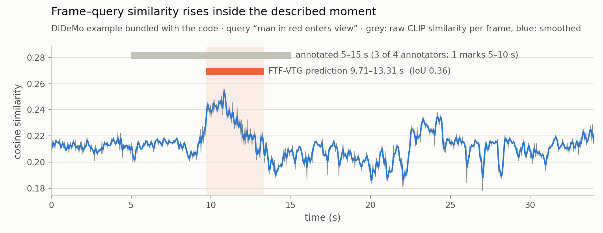
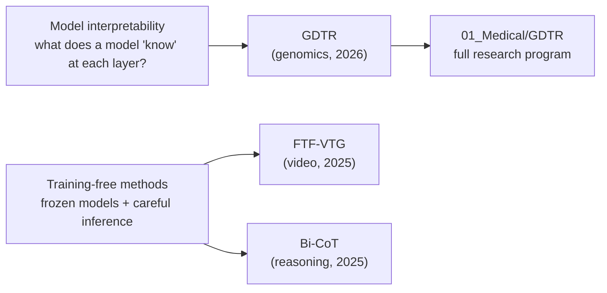

[🏠 Jiheon Kang](https://github.com/heoneyzi) › **📄 Paper**

# 📄 Papers

**Three accepted papers — genomic interpretability, video understanding and explainable reasoning.**

  

Each folder is a paper page: the question, the method in one diagram, the headline numbers (scoped exactly as reported), what I contributed, how to cite it, and a code snapshot or a link to the full research program.

<table>
<tr>
<td width="33%" valign="top">

 <b><a href="GDTR/README.md">🧬 GDTR — Layer-wise Settling Depth Reveals Biological Grammar in Genomic Foundation Models</a></b>
 Y. Cho, <b>J. Kang</b>, S. Park, S. Kim · a training-free settling depth for every nucleotide in Evo 2 7B; a chr22 calibration keeps 94.6 % of the effect on held-out chr17.
 <b>ICML 2026 GenBio Workshop — Oral · Author · follow-up ongoing</b>
</td>
<td width="33%" valign="top">

 <b><a href="FTFVTG/README.md">🎬 FTF-VTG — Maximizing Frame-Level Video Understanding for Efficient Video Temporal Grounding</a></b>
 <b>J. Kang</b>, S. Kim, H. Noh, H. Yang · one frozen CLIP + signal processing, no training: DiDeMo R@1 19.30, VidSTG mIoU 39.01 at 788 MiB (reported).
 <b>2025 IEIE Summer Conference · First author</b>
</td>
<td width="33%" valign="top">

 <b><a href="Bi-CoT/README.md">🔁 Bi-CoT — Forward Reasoning and Reverse Verification for Explainable Multi-Hop QA</a></b>
 <b>J. Kang</b>, S. Jung · inference-only multi-hop QA that shows every hop and re-checks the chain backwards: HotpotQA EM/F1 24.16/33.15 → 42.77/55.40 (draft-reported).
 <b>6th Korea AI Conference · First author</b>
</td>
</tr>
</table>

## 🧭 How the papers connect

A common thread: rather than training bigger models, each paper asks what a **frozen** model already contains and designs the inference or the measurement around it — layer-wise settling for a DNA model, frame-level similarity for video, and step-wise verification for multi-hop reasoning.

## 🔗 Related

- [🩺 01_Medical/GDTR](https://github.com/heoneyzi/Medical/blob/main/GDTR/README.md) — the experiments behind GDTR, the TDiG follow-up and the ongoing Evo 2 handoff line.
- [🎥 04_Deep_Daiv/Project/Multimodal](https://github.com/heoneyzi/Deep_Daiv/blob/main/Project/Multimodal/README.md) — the study track and research team that produced FTF-VTG.
- [🌀 03_Study/Hallucination](https://github.com/heoneyzi/Study/blob/main/Hallucination/README.md) — multimodal-LLM hallucination study that grew out of the same interest in what models attend to.

---
[🏠 Jiheon Kang](https://github.com/heoneyzi) · [Next: GDTR →](GDTR/README.md)

---

[Medical](https://github.com/heoneyzi/Medical) · [Paper](https://github.com/heoneyzi/Paper) · [Study](https://github.com/heoneyzi/Study) · [Deep_Daiv](https://github.com/heoneyzi/Deep_Daiv)

[Research website](https://heoneyzi.github.io/) · [CV (PDF)](https://heoneyzi.github.io/Jiheon_Kang_CV.pdf) · [Original repository archive](https://github.com/heoneyzi/Portfolio-Archive)
